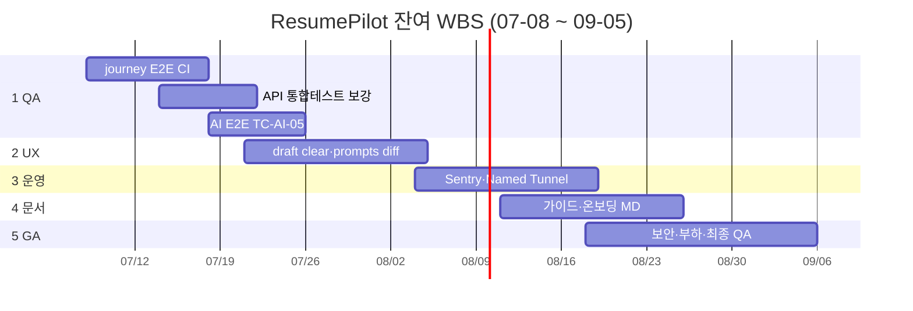

# ResumePilot WBS — 잔여 작업

> **문서 버전:** 3.0  
> **작성일:** 2026-07-07  
> **정본 현황:** [project-status.md](../project-status.md)  
> **프로젝트 착수:** 2026-07-05  
> **WBS 기준일:** 2026-07-08 (MVP·CI 완료 다음날)  
> **목표 마감:** 2026-09-05 (착수 후 2개월)

---

## 이 문서의 범위

| 포함 | 제외 |
|------|------|
| **2026-07-08 이후** 남은 작업 | 이미 완료된 백엔드·UI·Docker·CI (§완료 참조만) |
| Phase 9+ · QA 확장 · 운영 | 결제·소셜 로그인 |

**완료된 것 (WBS 작업 아님):** API 6서비스, Flyway V11, UI Phase 0–8, Docker 5컨테이너, `deploy.yml` HTTP+API+E2E smoke green — [project-status.md §2](../project-status.md#2-완료-산출물-2026-07-07-기준)

---

## 잔여 WBS 요약

| WBS | Phase | 내용 | 계획 시작 | 계획 종료 |
|-----|-------|------|-----------|-----------|
| **1** | QA·테스트 확장 | journey CI, API 테스트, AI E2E | 07-08 | 07-25 |
| **2** | UX Phase 9 | draft clear, prompts diff | 07-21 | 08-08 |
| **3** | 운영·관측 | Sentry, Named Tunnel, 로그 | 08-04 | 08-22 |
| **4** | 문서·온보딩 | 사용자 가이드, TC 정리 | 08-11 | 08-29 |
| **5** | 보안·성능·GA | 점검, 부하, 최종 QA | 08-18 | **09-05** |

---

## 간트 (잔여만)



---

## 마일스톤 (잔여)

| # | 마일스톤 | 계획일 | 완료 기준 |
|---|----------|--------|-----------|
| M10 | CI journey E2E | **07-18** | `user-journey.spec.ts` in deploy.yml |
| M11 | Phase 9 UX | **08-08** | draft clear + prompts diff |
| M12 | 운영 baseline | **08-22** | Sentry 또는 Named Tunnel 중 1+ |
| M13 | **2개월 GA** | **09-05** | TC-01~09 + TC-AI 수동 PASS 기록 |

---

## 상세 WBS

### 1.0 QA·테스트 확장 (07-08 ~ 07-25)

| WBS | 작업명 | 산출물 | 일 | 시작 | 종료 | 선행 | 상태 |
|-----|--------|--------|-----|------|------|------|------|
| 1.1 | `user-journey.spec.ts` CI 연동 | deploy.yml step 또는 script | 3 | 07-08 | 07-10 | — | ✅ |
| 1.2 | journey 실패 시 아티팩트 (screenshot/trace) | CI 설정 | 1 | 07-11 | 07-11 | 1.1 | 🔲 |
| 1.3 | `AuthIntegrationTest` `/users/me` 수정 | Gradle test green | 2 | 07-14 | 07-15 | — | ✅ |
| 1.4 | API smoke signup→login 동시성 회귀 테스트 | deploy-smoke 보강 | 1 | 07-15 | 07-15 | — | 🔲 |
| 1.5 | TC-AI-05 브라우저 시나리오 문서화 | deploy-test-cases 갱신 | 2 | 07-18 | 07-19 | — | ✅ |
| 1.6 | AI E2E `ai-flow.spec.ts` + CI | `deploy-smoke-e2e-ai.sh` | 5 | 07-20 | 07-25 | 1.5 | ✅ |

---

### 2.0 UX Phase 9 (07-21 ~ 08-08)

| WBS | 작업명 | 산출물 | 일 | 시작 | 종료 | 선행 | 상태 |
|-----|--------|--------|-----|------|------|------|------|
| 2.1 | Workspace draft **초기화** 버튼 | UI + localStorage clear | 2 | 07-21 | 07-22 | — | ✅ |
| 2.2 | AI result draft 초기화 (연동) | `useWorkspaceResult` | 1 | 07-23 | 07-23 | 2.1 | ✅ |
| 2.3 | Admin Prompts **버전 diff** 미리보기 | 모달 또는 split view | 5 | 07-24 | 07-30 | — | ✅ |
| 2.4 | VersionCompare UX 개선 (선택) | unified 기본값 등 | 2 | 08-04 | 08-05 | — | 🔲 |
| 2.5 | 모바일 Workspace Tabs QA | 수동 TC + 소폭 CSS | 3 | 08-06 | 08-08 | — | 🔲 |

---

### 3.0 운영·관측 (08-04 ~ 08-22)

| WBS | 작업명 | 산출물 | 일 | 시작 | 종료 | 선행 | 상태 |
|-----|--------|--------|-----|------|------|------|------|
| 3.1 | Sentry prod DSN 설정 | `.env.production.example` + 문서 | 2 | 08-04 | 08-05 | — | 🔲 |
| 3.2 | AI `ai_usage_logs` 대시보드 점검 | admin `/ai-logs` QA | 2 | 08-06 | 08-07 | — | 🔲 |
| 3.3 | Cloudflare **Named Tunnel** (Quick 대체) | SETUP.md 절 + systemd | 4 | 08-08 | 08-13 | — | 🔲 |
| 3.4 | deploy 실패 알림 (선택) | Actions notification / webhook | 2 | 08-14 | 08-15 | — | 🔲 |
| 3.5 | postgres 백업 절차 문서 | SETUP 또는 INFRASTRUCTURE | 2 | 08-18 | 08-19 | — | 🔲 |
| 3.6 | 운영 런북 1페이지 | incident 대응 요약 | 2 | 08-20 | 08-22 | 3.1 | 🔲 |

---

### 4.0 문서·온보딩 (08-11 ~ 08-29)

| WBS | 작업명 | 산출물 | 일 | 시작 | 종료 | 선행 | 상태 |
|-----|--------|--------|-----|------|------|------|------|
| 4.1 | **사용자 가이드** (첫 실행→자소서 생성) | `docs/user-guide.md` | 4 | 08-11 | 08-14 | — | 🔲 |
| 4.2 | 관리자 가이드 (프롬프트·금지어) | `docs/admin-guide.md` | 3 | 08-15 | 08-19 | — | 🔲 |
| 4.3 | OnboardingGuide ↔ 가이드 링크 | web UI | 1 | 08-20 | 08-20 | 4.1 | 🔲 |
| 4.4 | deploy-test-cases 결과 기록 채우기 | TC 표 PASS/FAIL | 2 | 08-25 | 08-26 | 1.x | 🔲 |
| 4.5 | project-status.md 분기 갱신 | 현황 문서 | 1 | 08-29 | 08-29 | 4.4 | 🔲 |

---

### 5.0 보안·성능·GA (08-18 ~ 09-05)

| WBS | 작업명 | 산출물 | 일 | 시작 | 종료 | 선행 | 상태 |
|-----|--------|--------|-----|------|------|------|------|
| 5.1 | JWT·CORS·rate limit 점검 | 체크리스트 + 소폭 수정 | 3 | 08-18 | 08-20 | — | 🔲 |
| 5.2 | Docker 이미지·의존성 취약점 스캔 | `docker scout` 또는 수동 | 2 | 08-21 | 08-22 | — | 🔲 |
| 5.3 | 부하 스모크 (k6 또는 ab, 선택) | 간단 리포트 | 3 | 08-25 | 08-27 | — | 🔲 |
| 5.4 | 전체 TC-01~09 + TC-AI 수동 회귀 | deploy-test-cases 표 | 5 | 08-28 | 09-03 | 1~4 | 🔲 |
| 5.5 | **GA 버퍼·릴리스 노트** | README + project-status | 2 | 09-04 | **09-05** | 5.4 | 🔲 |

---

## 완료 참조표 (WBS 미포함)

아래는 **2026-07-07까지 완료** — 일정에 넣지 않음.

| 영역 | 완료 내용 |
|------|-----------|
| 백엔드 | Spring API, Flyway V1–V11, JWT+jti, actuator |
| AI | prompt·rag·resume-ai 3서비스, RAG 파이프라인 |
| UI web | Landing~Workspace, shadcn, Phase 0–8 |
| UI admin | Prompts, Users, AI logs, Companies, Forbidden |
| Infra | Docker 5, SPA-in-JAR, resume-pilot.sh |
| CI/CD | deploy.yml, deploy-smoke.sh, deploy-smoke-e2e.sh ✅ |
| E2E | smoke 4 (CI), user journey (로컬) |

---

## 주차별 계획 (잔여)

| 주차 | 날짜 | 집중 | 목표 |
|------|------|------|------|
| W1 | 07-08~14 | 1.x | journey CI 착수 |
| W2 | 07-15~21 | 1.x, 2.x | API 테스트, UX 시작 |
| W3 | 07-22~28 | 2.x, 1.6 | prompts diff, AI E2E |
| W4 | 07-29~08-04 | 2.x, 3.x | Phase 9 UX, Sentry |
| W5 | 08-05~11 | 3.x, 4.x | Tunnel, 가이드 |
| W6 | 08-12~18 | 4.x, 5.x | 문서, 보안 |
| W7 | 08-19~25 | 5.x | 부하·회귀 |
| W8 | 08-26~09-05 | 5.x | **GA** |

---

## Excel TSV (잔여만)

```
WBS	작업명	기간(일)	계획시작	계획종료	선행	Phase	상태
1.0	QA·테스트 확장	14	2026-07-08	2026-07-25	—	1	🔲
1.1	user-journey CI	3	2026-07-08	2026-07-10	—	1	🔲
2.0	UX Phase 9	15	2026-07-21	2026-08-08	—	2	🔲
2.1	draft clear	2	2026-07-21	2026-07-22	—	2	🔲
2.3	prompts diff	5	2026-07-24	2026-07-30	—	2	🔲
3.0	운영·관측	15	2026-08-04	2026-08-22	—	3	🔲
4.0	문서·온보딩	15	2026-08-11	2026-08-29	—	4	🔲
5.0	보안·GA	19	2026-08-18	2026-09-05	1-4	5	🔲
```

---

## 관련 문서

- [project-status.md](../project-status.md) — 완료/잔여 정본
- [ui-roadmap.md](../ui-roadmap.md) — UI Phase 이력
- [deploy-test-cases.md](../deploy-test-cases.md) — QA TC
- [deployment.md](../deployment.md) — CI 파이프라인
- [reports/deploy-ci-incidents-2026-07-07.md](../reports/deploy-ci-incidents-2026-07-07.md)

---

*WBS v3.0 — 완료분 제외, 잔여만 2026-07-08 ~ 2026-09-05*
