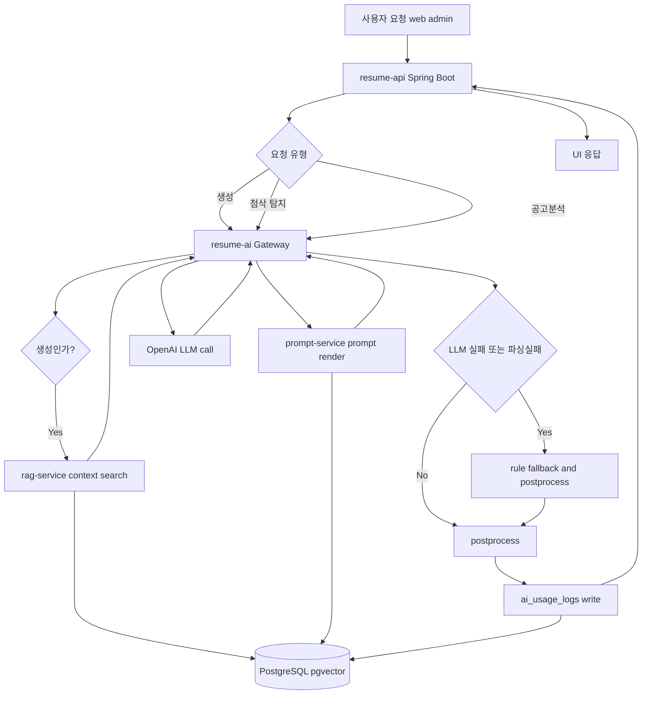
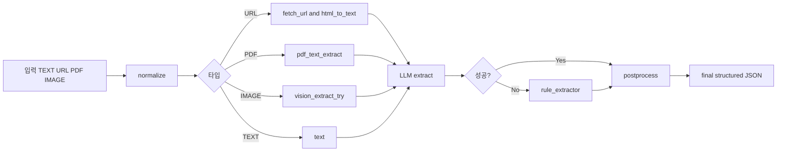
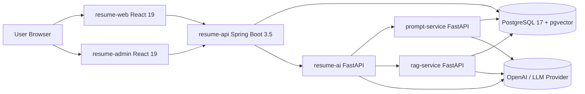
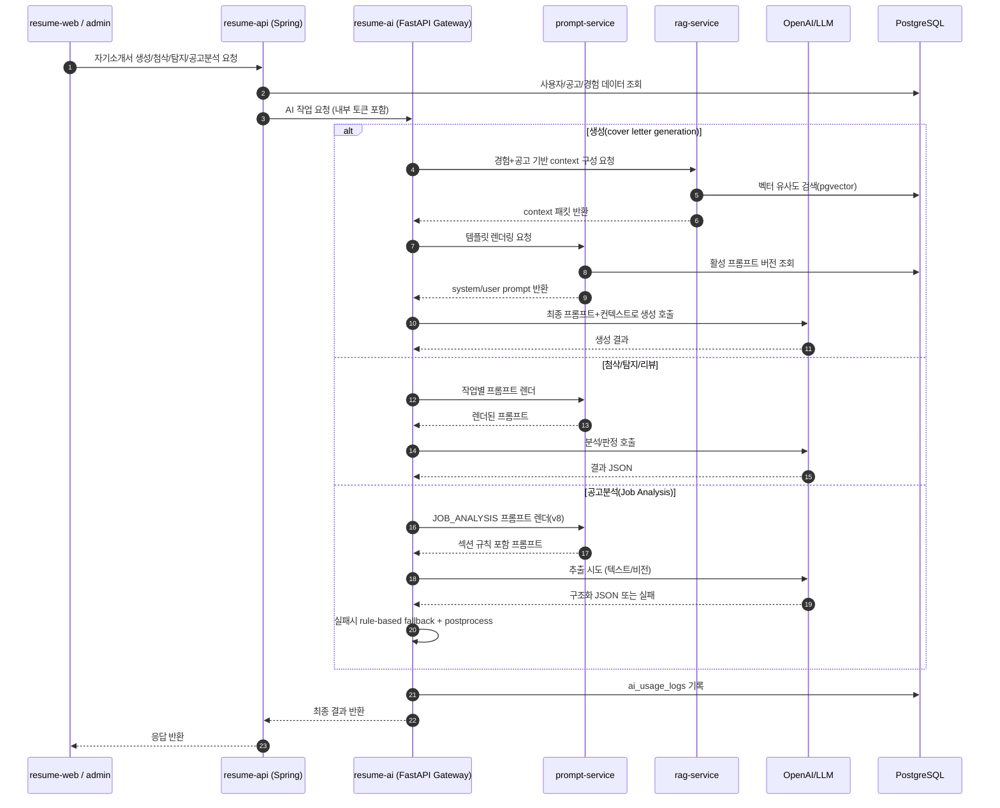
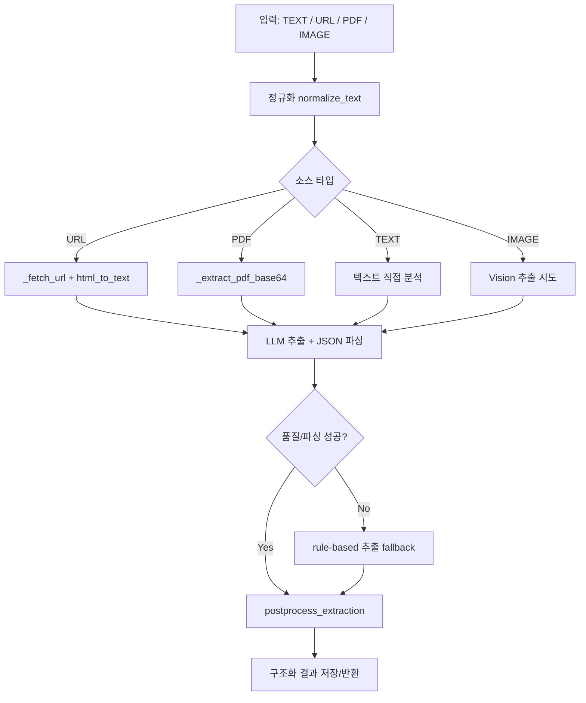

# ResumePilot 개발 스택 · AI 동작 분석 (2026-07-09)

기준 커밋: `66555d7`

## 0) AI 오케스트레이션(오케스트리세이션) 요약 순서도

### 0-0. 텍스트(ASCII) 순서도 (프로세스 기준)

> 기준: "생성" 업무의 표준 실행 순서 (`RAG -> Prompt -> LLM`)

```text
React (resume-web / resume-admin)
            |
            v
Spring Boot (resume-api)
            |
            v
AI Gateway Orchestrator (resume-ai)
            |
            v
RAG Engine (rag-service)
  - vector search
  - context build
            |
            v
Prompt Engine (prompt-service)
  - prompt version load
  - system/user prompt render
            |
            v
LLM Router (OpenAI / model selection)
            |
            v
Postprocess + Validation
            |
            v
ai_usage_logs write
            |
            v
API response to client
```

### 0-0-KR. 텍스트(ASCII) 순서도 (한글 버전)

> 기준: "자기소개서 생성" 업무의 표준 실행 순서 (`RAG -> Prompt -> LLM`)

```text
React (resume-web / resume-admin)
            |
            v
Spring Boot (resume-api)
            |
            v
AI 게이트웨이 오케스트레이터 (resume-ai)
            |
            v
RAG 엔진 (rag-service)
  - 벡터 검색
  - 컨텍스트 구성
            |
            v
프롬프트 엔진 (prompt-service)
  - 프롬프트 버전 로드
  - system/user 프롬프트 렌더링
            |
            v
LLM 라우터 (OpenAI / 모델 선택)
            |
            v
후처리 + 검증
            |
            v
ai_usage_logs 기록
            |
            v
클라이언트 응답 반환
```

### 0-0-KR-ALT. 요청하신 형태(양갈래 ASCII)

```text
                 React (resume-web / resume-admin)
                           |
                           |
                    Spring Boot (resume-api)
                           |
                ----------------------
                |                    |
         PostgreSQL 17         FastAPI (resume-ai)
          + pgvector                |
                |              RAG Engine
                |             (rag-service)
                |                  |
                |            Prompt Engine
                |         (prompt-service)
                |                  |
                ----------------------
                           |
                    LLM (OpenAI)
```

> 참고: 위 블록은 요청하신 "모양"을 맞춘 그림입니다.  
> 실제 실행 순서는 아래 `0-0-1-KR`(업무별 프로세스 차이) 기준으로 보시면 정확합니다.

### 0-0-1. 업무별 프로세스 차이

```text
[A] 생성 (Generation)
Gateway -> RAG -> Prompt -> LLM -> Postprocess

[B] 첨삭/탐지 (Review/Detection)
Gateway -> Prompt -> LLM -> Postprocess
(* RAG 생략 가능)

[C] 공고분석 (Job Analysis)
Gateway -> Prompt(JOB_ANALYSIS v8) -> LLM
        -> 실패 시 rule fallback -> Postprocess
(* RAG 보통 미사용)
```

### 0-0-1-KR. 업무별 프로세스 차이 (한글 버전)

```text
[A] 생성
게이트웨이 -> RAG -> 프롬프트 -> LLM -> 후처리

[B] 첨삭/탐지
게이트웨이 -> 프롬프트 -> LLM -> 후처리
(* RAG는 생략될 수 있음)

[C] 공고분석
게이트웨이 -> 프롬프트(JOB_ANALYSIS v8) -> LLM
        -> 실패 시 규칙 기반 fallback -> 후처리
(* RAG는 일반적으로 사용하지 않음)
```

### 0-0-2. AI 관련 프로세스 전체 맵 (업무별)

```text
[1] 자기소개서 생성 (Generation)
resume-api -> resume-ai(Gateway) -> rag-service(context) -> prompt-service(render) -> LLM -> postprocess -> ai_usage_logs -> 응답

[2] 첨삭 (Review)
resume-api -> resume-ai(Gateway) -> prompt-service(render) -> LLM -> 리뷰 JSON 정규화 -> ai_usage_logs -> 응답

[3] AI 흔적 탐지 (Detection)
resume-api -> resume-ai(Gateway) -> prompt-service(render) -> LLM or rule-based -> 위험 문장/사유 반환 -> ai_usage_logs

[4] 공고 분석 (Job Analysis)
resume-api -> resume-ai(Gateway)
           -> (TEXT/URL/PDF/IMAGE 전처리)
           -> prompt-service JOB_ANALYSIS v8
           -> LLM 추출
           -> 실패시 rule fallback
           -> postprocess(섹션 매핑/중복제거)
           -> ai_usage_logs -> 응답

[5] 인터뷰 질문 생성
resume-api -> resume-ai(Gateway) -> prompt-service(render) -> LLM -> 질문 세트 반환 -> ai_usage_logs
```

### 0-1. 전체 오케스트레이션 (가장 간단 버전)



### 0-2. 공고분석(Job Analysis) 전용 순서도



---

## 1) 한눈에 보는 현재 스택

| 영역 | 현재 코드 기준 버전/이미지 | 근거 파일 |
|---|---|---|
| Backend API | Java 21, Spring Boot `3.5.0`, Dependency Management `1.1.7` | `resume-api/build.gradle` |
| DB | PostgreSQL 17 + pgvector (`pgvector/pgvector:pg17`) | `docker-compose.yml` |
| User/Admin Frontend | React `^19.2.7`, TypeScript `~6.0.2`, Vite `^8.1.1`, Tailwind `^4.3.2`, React Router `^7.18.1`, React Query `^5.101.2` | `resume-web/package.json`, `resume-admin/package.json` |
| AI 서비스 공통 런타임 | Python `3.12` (`python:3.12-slim`) | `resume-ai/Dockerfile`, `prompt-service/Dockerfile`, `rag-service/Dockerfile` |
| AI Gateway | FastAPI `>=0.115.0`, Uvicorn `>=0.32.0`, OpenAI SDK `>=1.57.0`, PyPDF `>=5.1.0`, Tesseract OCR | `resume-ai/requirements.txt`, `resume-ai/Dockerfile` |
| Prompt Service | FastAPI `>=0.115.0`, asyncpg `>=0.30.0`, OpenAI SDK `>=1.57.0` | `prompt-service/requirements.txt` |
| RAG Service | FastAPI `>=0.115.0`, asyncpg `>=0.30.0`, NumPy `>=2.1.0`, OpenAI SDK `>=1.57.0` | `rag-service/requirements.txt` |
| 배포 구성 | Docker Compose 5컨테이너 (`app`, `postgres`, `resume-ai`, `prompt-service`, `rag-service`) | `docker-compose.yml` |

> 참고: 프론트/파이썬 패키지는 `^`, `~`, `>=` 범위를 사용하므로 실제 설치 patch/minor는 시점에 따라 달라질 수 있습니다.

---

## 2) "현재 버전 vs 프레임워크 기준 버전" 비교

여기서 "프레임워크 기준 버전"은 프로젝트 아키텍처 문서(`docs/아키텍처.md`)에 명시한 목표/표준 스택입니다.

| 영역 | 현재 코드 기준 | 아키텍처 문서 기준 | 비교 결과 |
|---|---|---|---|
| Backend | Spring Boot `3.5.0`, Java 21 | Spring Boot 3.5, Java 21 | 일치 |
| Frontend | React `^19.2.7`, TS `~6.0.2`, Vite `^8.1.1`, Tailwind `^4.3.2` | React 19, TS 6, Vite 8, Tailwind 4 | 일치 (세부 patch는 범위형) |
| AI 런타임 | Python 3.12-slim | Python 3.12 | 일치 |
| AI 프레임워크 | FastAPI + Uvicorn + Pydantic v2 | FastAPI + Uvicorn + Pydantic v2 | 일치 |
| Vector DB | PostgreSQL 17 + pgvector | PostgreSQL 17 + pgvector | 일치 |
| AI 프롬프트 버전 | Job Analysis Prompt `v8` | (문서 일반원칙: prompt-service 기반 로드) | 원칙 일치 + 최신 버전 적용 |

---

## 3) 시스템 아키텍처 그림



---

## 4) AI가 실제로 동작하는 방식 (이해하기 쉽게)

### 4-1. 역할 분리

- `resume-api`: 사용자 요청/인증/도메인 저장 담당
- `resume-ai`: 생성·첨삭·탐지·공고분석의 AI 오케스트레이터
- `prompt-service`: 프롬프트 템플릿 버전 관리 + 렌더링
- `rag-service`: 임베딩/유사도 검색/컨텍스트 구성

### 4-2. 핵심: AI Gateway 오케스트레이션(서비스 호출 순서)

사용자가 궁금해한 포인트를 한 줄로 요약하면:

`resume-api`는 "업무 진입점", `resume-ai`는 "AI 워크플로우 오케스트레이터"입니다.



### 4-3. 대표 플로우: 공고 분석(Job Analysis)



### 4-4. 핵심 포인트

- LLM 실패 시 **rule-based fallback**으로 결과를 비우지 않음
- 섹션 매핑 강제 (`지원 자격 -> required_skills`, `우대요건 -> preferred_skills` 등)
- 후처리에서 중복/오염 정리 후 최종 JSON 반환
- 프롬프트는 DB 버전(`V22`, Job Analysis `v8`)을 통해 운영

---

## 5) 현재 AI 품질 관련 최신 반영 사항

- Job Analysis Prompt: `v8`
  - 섹션 정확 분리
  - 교차 중복 억제
  - 우대사항 누락 방지
- URL 경로 분석 보강
  - `지원 자격`, `우대요건` 패턴 인식 강화
  - postprocess에서 required/preferred 복구 로직 강화

---

## 6) 실무 관점에서 보는 장단점

### 장점
- AI 기능을 서비스별로 분리해 장애 전파를 줄임
- prompt-service로 프롬프트 버전 관리가 가능해 실험/롤백이 쉬움
- rule fallback이 있어 API 키/모델 이슈 시에도 기본 기능 유지

### 주의점
- 프론트/파이썬 의존성이 범위형(`^`, `>=`)이라 환경별 미세 차이가 생길 수 있음
- AI 품질은 모델 자체보다도 프롬프트 버전/후처리 규칙 영향이 큼
- PWA/캐시(서비스워커)로 배포 직후 UI 확인 시 구버전이 보일 수 있음

---

## 7) 추천 운영 체크리스트

- 배포 직후:
  - `/admin/ai-logs`에서 `job_analysis` 모델/방법(`+llm`/`+rule`) 확인
  - 대표 URL 공고 2~3개 재분석 smoke
- 릴리즈 문서화:
  - 프롬프트 버전(`v8 -> v9`) 변경점과 회귀 테스트 케이스를 함께 기록
- 버전 고정 전략:
  - 주요 프로덕션 릴리즈 시점에는 lockfile 기반 빌드 재현성 확인

