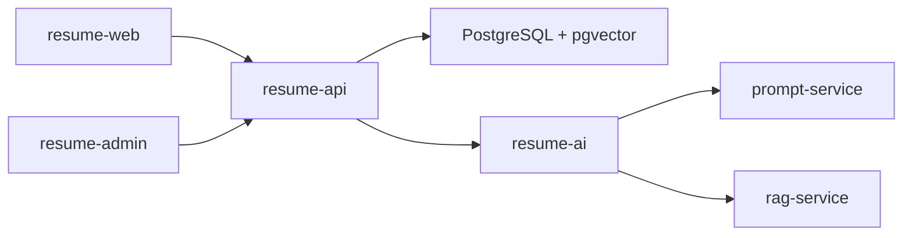

# ResumePilot — 구현 요약

RAG 기반 **기업 맞춤 자기소개서 작성·첨삭** 플랫폼. 경험 라이브러리 → 공고 분석 → RAG 추천 → AI 생성·첨삭·흔적 탐지. AI는 사용자 경험을 지어내지 않는다.

## 스택

| 구분 | 내용 |
|------|------|
| API | Java 21, Spring Boot 3.5, JPA, QueryDSL, Flyway, JWT |
| 사용자 UI | React 19, Vite 8, Tailwind 4, TanStack Query, shadcn/Radix (`resume-web`) |
| 관리자 UI | 동일 스택 (`resume-admin`, `/admin/`) |
| AI | FastAPI ×3 — Gateway(`resume-ai`), 프롬프트(`prompt-service`), RAG(`rag-service`) |
| DB | PostgreSQL 17 + pgvector |
| 인프라 | Docker Compose 5컨테이너, GitHub Actions self-hosted, nginx |

Docker 포트: 앱 `:9180`. 로컬은 API `:8080`, web `:5173`, admin `:5174`, AI `:8000`–`:8002`.

## 아키텍처

```
resume-pilot/
├── resume-api/        # JWT, 도메인 CRUD, AI 오케스트레이션, Flyway 소유
├── resume-web/        # 사용자 SPA
├── resume-admin/      # 관리자 SPA
├── resume-ai/         # AI Gateway
├── prompt-service/    # 프롬프트 로드·버전 (하드코딩 금지)
├── rag-service/       # 임베딩·벡터 검색
└── docker-compose.yml
```



프로덕션은 `postgres` + `app`(SPA-in-JAR) + AI 3서비스. 프롬프트는 prompt-service에서만 로드하고, AI 호출은 `ai_usage_logs`에 기록한다.

## 주요 구현

- 경험 라이브러리, 채용공고 관리·분석, 글쓰기 스타일
- Workspace 3-pane 자기소개서 작성, 이력서 버전
- RAG 컨텍스트 조립, 생성·첨삭·흔적 탐지·면접 질문
- 작업별 LLM failover (`llm_providers`, `llm_model_routes`)
- 관리자: 프롬프트 버전·diff, 금지어, 사용자·역할, AI 로그, Deploy CI
- JWT Access 15분 + Refresh 7일

## 관련 문서

- [아키텍처.md](아키텍처.md)
- [실행-가이드.md](실행-가이드.md)
- [인프라-구성.md](인프라-구성.md)
- [RAG-파이프라인.md](RAG-파이프라인.md)
- [README.md](../README.md)
